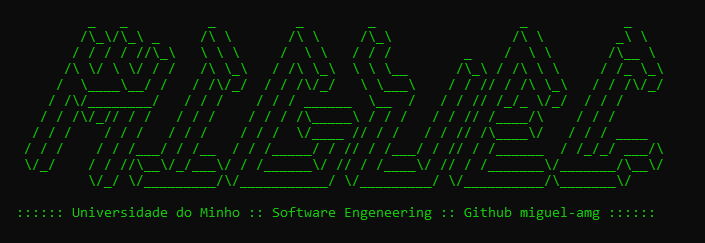

  

Studying Software engeneering at Universidade do Minho, Portugal.

**Currently studying:**
- Machine learning
- Computer graphics
- Human–computer interaction
- Web engineering
- Programming language theory
- Information systems security (INFOSEC)

 

## 🎓 Learning
   
   
   
   
  
